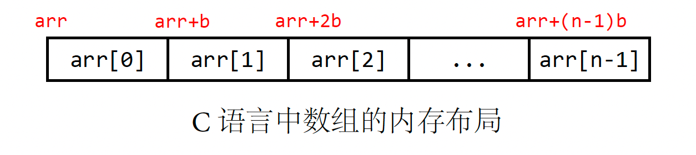
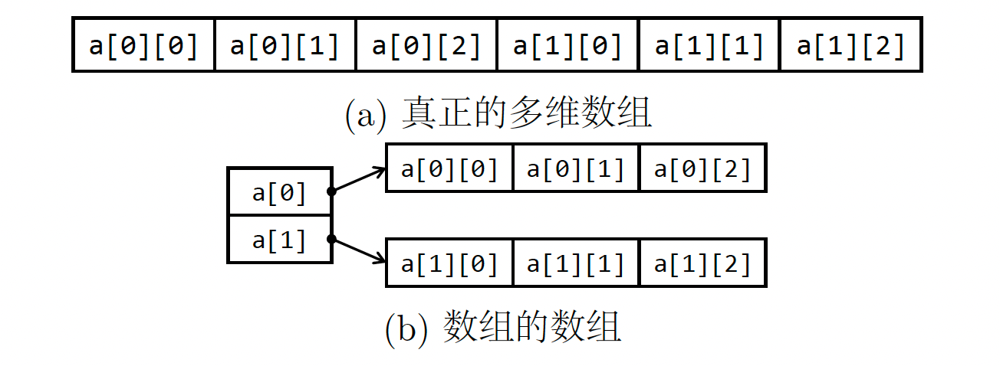
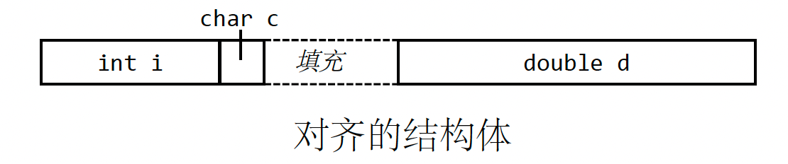
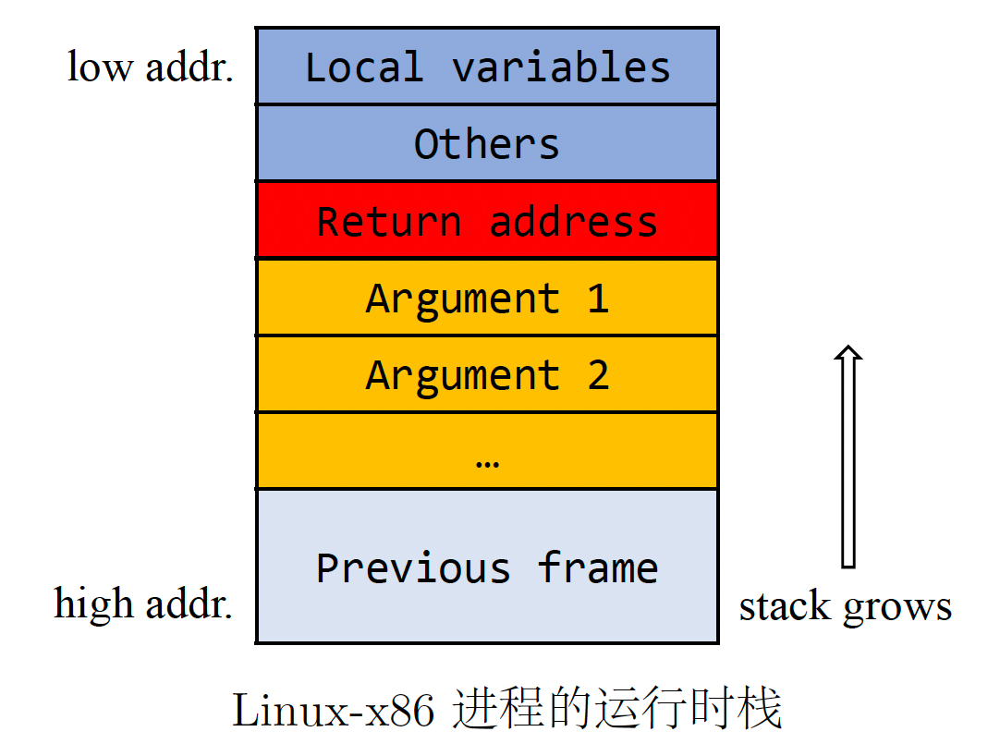
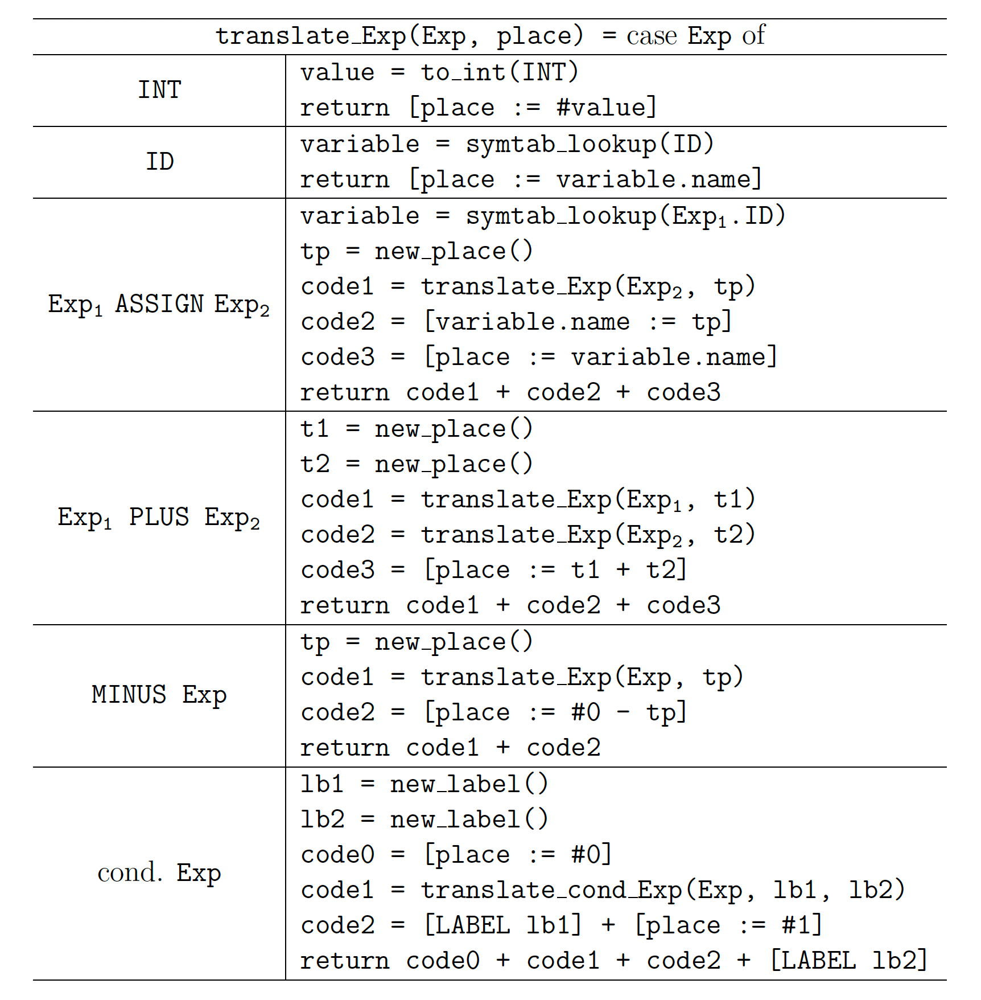
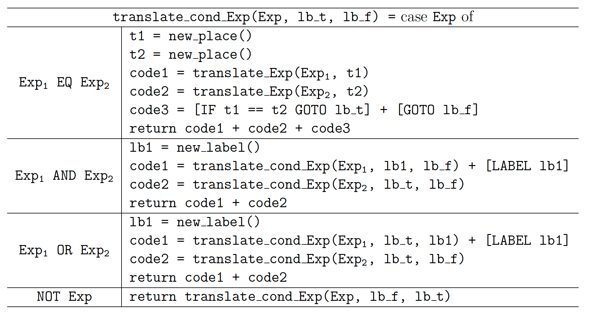
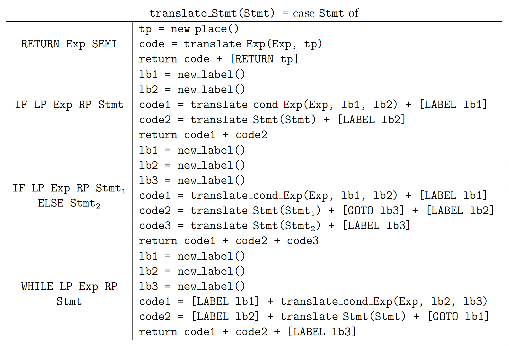
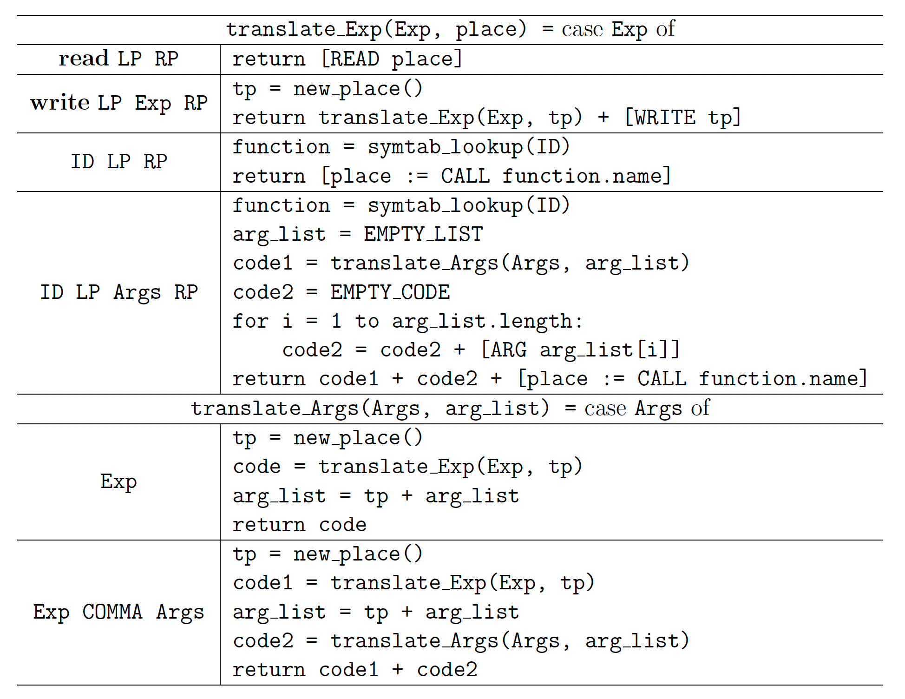
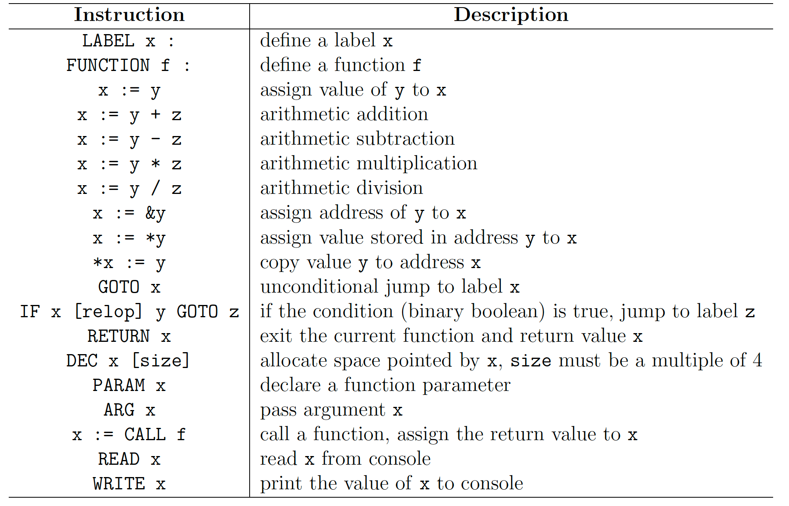

# 阶段 3：中间代码生成

## 1. 概述

到目前为止，我们已经完成了 BPL 编译器的分析部分，准备进入综合（或生成）部分。 目前，您的编译器可以识别有效的 BPL 程序。 在第 3 阶段，编译器将为给定的源程序生成中间表示 (IR)。 IR 可以进一步优化以获得更好的运行时性能。

大多数编译器首先将源程序翻译为某种形式的 IR，然后将其转换为机器代码。 IR 是原始源代码的独立于机器和语言的表示。 尽管两次转换代码会带来额外的成本，但使用 IR 可以增强抽象性，并在前端和后端之间实现更清晰的分离。 IR 还有助于高级编译器优化。 事实上，大多数优化都是在中间代码上完成的，而不是源代码或目标代码。

从更广泛的意义上讲，IR可以是编译阶段原始程序的任何形式，例如词法分析器生成的标记流、语法分析器生成的解析树、代码生成器生成的三地址代码等。 当我们在这个项目中谈论IR时，我们主要指的是三地址代码（TAC），其中每条指令最多可以有三个操作数（地址）。 我们将在附录 A 中详细说明我们的 TAC 指令集。我们提供了一个模拟器来执行生成的 TAC，该模拟器也安装在我们的实验室虚拟机中。

您将继续在语义分析器之上生成代码。 还请注意保持代码的可维护性和可扩展性，因为 SPL 编译器的后续部分依赖于您在这里的工作。

## 2. 实验环境

我们准备了一个 IR 模拟器，以便您可以运行生成的 TAC。 它已经安装在实验室虚拟机中。 它是用 Python 模块 urwid 构建的。 如果您想在自己的计算机上运行它，请确保您已经安装了 urwid。 注意urwid不支持Windows环境。（略）

## 3. 中间表示

在表示格式方面，有线性IR、树IR、图IR等。在第一阶段，我们将源代码转换为解析树，它在概念上是树IR的一种形式。 此阶段的输出（TAC 指令）是一种线性 IR。 您还可以将 TAC 指令组织成图 IR，其中节点表示不跳转的指令序列，边表示两个基本块之间的无条件/条件跳转。 这种 IR 称为控制流图，它有助于许多现代编译器优化，例如常量传播和死代码消除。

通常情况下，从某些语法节点翻译过来的 TAC 段不会立即打印出来，因为您可能会重新组织代码结构或对中间代码进行优化。 因此，您需要将它们存储在内存中，然后再将它们打印到生成的代码文件中。 为此，重要的是要考虑如何使用正确的数据结构来存储它们。

TAC 通常存储在一组四元组中。 每个四元组都是一个对象（记录），由四个字段组成：一个运算符、两个操作数（源）和一个目标（结果）。 为了形成块，编译器需要一种连接各个四元组的机制。 下图显示了用于实现表达式 `a - 2 * b` 的 TAC 的三种不同结构。


图 a 是最直接的实现，其中预先分配了一个大数组。 数组中的每个元素都存储一条 TAC 指令。 然而，它的效率较低。 每次在中间插入一条新指令时，都应该将所有后续元素向后拉一位。 此外，代码大小受到数组长度的限制。 指针数组实现（图 b）继承了数组实现的相同限制，只是移动元素更便宜，因为只交换地址，而不是四元组列表。 更推荐使用图 c 中的双向链表，尽管它比前两种样式更复杂。 链表数据结构在插入、删除和元素替换方面都是高效的。 而且，它不需要预先分配空间，因此代码大小可以任意大（只要内存足够）。

## 4. 运行时环境

编程语言提供了硬件细节的抽象，例如名称、范围、数据类型、运算符、函数和控制流结构。 然而，现代计算机硬件只能理解低级原语，例如，32/64 位整数的算术运算、数据移动和布尔表达式的控制结构。 编译器必须与操作系统配合以支持目标体系结构上的高级抽象。

为此，编译器不能仅仅翻译代码。 它还应该生成额外的代码，以通过低级操作来维护高级功能。 在代码生成过程中，编译器应该管理目标机机制，以便生成的代码可以在相同的运行时环境中运行。 运行时环境包含许多与目标机器相关的细节。 在此阶段，我们仅讨论一些一般概念以及如何用我们的 TAC 规范来表示它们。 在下一阶段，我们将介绍更多有关目标运行时的信息，即 MIPS 架构。

### 4.1. 数据表示

许多高级语言提供各种简单的数据类型：

- 字符：1 或 2（宽字符）字节；
- 整数：2、4 或 8 字节；
- 布尔值：1 位（通常至少使用 1 个完整字节）。

大多数硬件直接支持这些类型。 此外，C 语言中的指针类型存储为无符号整数。 它们的范围取决于目标体系结构，即支持最大 4GB 内存寻址的 32 位计算机为 4 字节，64 位计算机为 8 字节。 实际上，在低级别上，指针和无符号整数之间几乎没有什么区别：它们都是数字，唯一的区别是编译器如何解释这些数字。



数组在连续的内存空间中存储一组元素。 这些元素在存储器中从低地址位置到高地址位置连续存储。上图显示了 C 风格的数组表示形式。 顶部标签代表每个元素的起始地址，而 `b` 是单个元素的宽度。 回想一下，名称 `arr` 是一个常量指针，它指向数组的起始地址。 一般来说，对于具有 `n` 个元素的一维数组 `arr`，第 `i` 个（从 0 开始计数）元素存储在内存位置 `arr+i*b` 中。 BPL程序的运行时也采用这种数组表示形式。

多维数组的编码有两种策略：真正的多维数组（图 a）和数组的数组（图 b）。 真正的多维数组是一个连续的块。 在行优先配置中，行被一个接一个地存储。 对于 $m × n$ 32 位整数数组，元素 `arr[i][j]` 的地址为 `arr + 4 * (n * i + j)`。



在数组的数组表示中，访问一个元素涉及两次指针取消引用，而之前的表示只需要一次。 数组的数组更耗费空间：对于一个 $n_1 \times n_2 \times\cdots\times n_k$ 数组，数据字段与真实表示完全相同，但会多出 $n_1 \times n_2 \times\cdots\times n_{k-1}$ 个指针字段。 BPL 运行时采用第一种策略。 尽管如此，第二种方法仍然因其灵活性而被认为是有利的。

结构变量通过在连续块中顺序分配字段来存储，然后由基地址加成员偏移量表示成员访问。 结构体类型 `struct{int i; char c; double d;}` 需要 13 个字节，各个字段位于距基地址 0、4 和 5 个字节的偏移处。 然而，它实际上会为此结构分配 16 个字节，因为它将在字段之间插入填充，以便每个字段从对齐的边界开始，如下图所示。



BPL运行时仅限于整数类型，因此不必考虑数据结构对齐。 但是，如果您想支持更多样化的数据类型，例如 `char` 或 `short`，您应该注意 MIPS 架构要求运行时内存中的所有变量都与地址长度对齐（32 位机器上为 4 字节）。

### 4.2. 函数调用

每个活动函数都有自己的激活记录，其中存储与函数调用相关的信息。 这些信息包括参数、局部变量、寄存器、返回地址等。在大多数架构中，激活记录存储在堆栈中，因此函数的激活记录也称为堆栈帧。

在这个项目中，您将不会处理有关如何维护堆栈帧的细节，因为它是依赖于机器的。 您应使用 `ARG` 语句显式传递参数，然后使用 `CALL` 语句通过函数的标识符调用函数。

传递参数有两种主要方法：按值传递和按引用传递。 在 BPL 运行时中，原始类型参数按其真实值传递。 当函数处于活动状态时，这些值在堆栈帧上有自己的副本，并且更改副本不会影响它们位于调用者帧中的原始值。 对于派生类型参数，被调用函数接受其引用，即其起始地址。 在 C 语言中，我们将显式传递结构体指针以避免复制整个结构体，而在 BPL 中，结构体参数会隐式转换为其起始地址。 这种运行时行为应该由编译器维护：要传递结构变量 `s1`，您应该通过 `ARG &s1` 而不是 `ARG s1` 推送它； 要访问特定偏移量处的成员，应将基地址添加到偏移量，然后使用解引用运算符 `*` 访问新地址。

以相反的顺序压入参数的原因是什么（见附录）？ 答案与调用序列的内存布局有关。 以 Linux-x86 运行时为例：



当调用函数时，一个新的帧将被压入堆栈。 这里，“压入”动作包含多个步骤：首先将参数压入（从高地址到低地址），然后将返回地址记录在参数之上，最后准备局部变量的内存单元。 从局部变量到参数的内存部分构成了被调用者的新堆栈帧。

由于参数是一个一个压入的，因此第一个压入的参数位于堆栈底部（高地址），最后一个压入堆栈顶部（低地址）。 这就是为什么我们应该以相反的顺序推动它们。 这样，在函数体中获取参数就很简单：参数将由返回地址寄存器的偏移量表示。 在该示例中，参数 1 可以用 `%ret+4` 表示，参数 i 可以用 `%ret+4*i` 表示。 这里，4（字节）是32位机器上的地址长度。（实际上，没有 `%ret` 寄存器，但是 `%ebp` 寄存器以常量偏移量存储 `%ret`。）

## 5. 翻译方案

要从解析树生成 TAC，您需要按后序遍历树，然后根据某些特定模式转换树节点。 您将使用语法制导的翻译来完成此任务。 在实现时，您必须为每个非终结符 X 实现一组 `translate_X` 函数，并直接或间接递归地调用这些函数。 我们将介绍一些翻译特定产生式的示例，尽管可能还有其他翻译方式，例如构造相应的控制流图并通过跳转指令链接基本块。

### 5.1. 表达式

我们将表达式分为基本表达式和条件表达式。 它们占据了我们 `BPL` 语言规范中语法符号 Exp 的 26 条重写规则的一部分。 本节列出了他们的一些翻译方案。

#### 5.1.1. 基本表达式

下表显示了基本表达的翻译方案。 我们假设您在第 2 阶段构建的符号表是全局可访问的。 函数 `symtab_lookup` 接受变量标识符的字符串，并返回相应的符号信息。 参数 `place` 是存储该表达式求值结果的地址变量。` translate_Exp` 返回节点 `Exp` 及其子节点的 TAC 代码。



右栏中，一对括号括起来的代码代表一条具体的 TAC 指令，在两条 TAC 指令上使用加号（`+`）表示将它们连接起来。

前两个重写规则的翻译方案很简单。 对于赋值表达式的产生，我们已经通过语义分析将左值约束为标识符、数组表达式或结构体表达式。 这里我们只展示左侧是标识符时的情况，即 `Exp1 -> ID`，稍后我们将在第 5.4 节中详细讨论最后两种情况。 回想一下，赋值运算符是右结合的，所以我们应该首先计算 `Exp2`，然后将结果值赋给相应的变量。

对于算术运算，我们应该计算两个操作数，然后对它们应用相应的运算符。 在这里，我们定义了从左到右的评估顺序，因此我们先评估 `Exp1`，然后再评估 `Exp2`。 表达式的一元减法会导致负数情况，可以通过从零减去自身来简单地表示。

BPL 语法中定义了 9 个条件表达式（3 个布尔值和 6 个比较）。 它们的值为 0 或 1。我们通过辅助函数 `translate_cond_Exp` 来翻译这些表达式，这将在第 5.1.2 节中进行说明。

#### 5.1.2. 条件表达式

条件表达式通常用在 `if` 和 `while` 语句中，其中涉及条件跳转指令。 这些跳转指令将与条件表达式的 `IR` 代码一起生成。 我们定义了一个辅助函数 `translate_cond_Exp`，它带有两个附加参数，`lb_t`指定当条件计算为 TRUE（本质上是 1）时要跳转的位置（标签），`lb_f` 用于FALSE情况，用于翻译条件表达式。 您应该确保 `translate_cond_Exp` 的第一个参数始终是条件表达式。 这可以在翻译之前检查。

下表中的方案产生 `AND`/`OR` 运算的短路评估。 要查看效果，请考虑规则 `Exp1 AND Exp2`：当通过 `translate_cond_Exp(Exp1, lb1, lb_f) `的 IR 代码将 `Exp1` 计算为 FALSE（即 0）时，控制流直接跳转到 `lb_f` 并跳过 `code2` 。 对于 TRUE 的情况，将执行 `code2` 来计算整个 AND 表达式。 相同的机制也适用于 OR 表达式。



我们列出了 4 个条件操作的翻译方案（对于其他情况，只需替换 `EQ` token）。 事实上，由于 C 是弱类型的，非条件表达式也可以用在控制流语句中。 一个广泛使用的例子是 `while(T--){}` 块，其中循环体将对任何非负整数 T 执行 T 次，并且当 T 达到零时循环终止。 您可以考虑如何翻译这种控制流，并将其实现为编译器的额外功能。

### 5.2. 语句

下表显示了语句的翻译方案。 为了翻译控制流语句（即 `if` 和 `while`），我们利用之前定义的函数 `translate_cond_Exp`。 翻译条件表达式引入了条件跳转，而语句的翻译方案中只有无条件跳转。



### 5.3. 函数调用

在翻译函数之前需要做一件事：您应该向符号表添加一个 `read` 函数，该函数不带参数并返回一个整数值，以及一个接受单个整数参数的`write` 函数。 这两个预定义函数为 BPL 程序提供用户交互 (I/O)。 它们有特殊的翻译方案：`read` 函数调用应翻译为 `READ` 指令，`write` 为 `WRITE` 指令。

与函数调用相关的重写规则有两种，一种是带参数的，另一种是不带参数的。 内置函数 `read` 和 `write` 有自己的翻译方案。它们显示在下表的前两行中。请注意，`write` 函数仅接受一个参数，因此我们将 `Args` 符号直接重写至 `Exp`。



让我们重新审视 BPL 运行时中的参数传递顺序。 我们已经提到（第 4.2 节），参数应该以与声明相反的顺序推入堆栈。 在 `Args` 的转换方案中，我们通过传递附加的 `arg_list` 参数来完成此行为。 每次评估新参数时，其引用都会插入到该列表的头部。 在插入 `CALL` 指令之前，我们从 `arg_list` 中弹出这些引用并生成其相应的 `ARG` 指令。 在这里，我们模拟先进后出列表，因此被调用函数的参数从左到右计算，并且它们将从右到左压入运行时堆栈。

值得一提的是，C语言的求值顺序是一种未定义的行为。 函数参数由逗号表达式指定，编译器可以按任意顺序计算每个子表达式。例如，要调用 `foo(a+b, a-b, -a)`，编译器可以生成从左到右、从右到左计算的代码，甚至先计算 `a-b`，然后是 `-a`，然后再计算 `a+b`。 在提供的翻译方案中，我们为函数参数定义从左到右的求值顺序。 但是，您可以根据不同的评估顺序生成代码。 唯一重要的事情是参数应该以正确的顺序传递。

### 5.4. 派生数据类型

BPL 中有两种派生日期类型：数组和结构体。 与宽度固定的整数不同，我们应该在使用派生类型的变量之前通过使用具有声明类型大小的 `DEC` 语句来动态分配内存。 一般来说，派生数据类型可以被视为元素的集合。 访问特定元素可以用 `base + offset` 的形式表示，其中 `offset` 是根据前面元素的大小计算的。 使用派生类型变量有两种重写规则：`Exp -> Exp LB Exp RB` 和 `Exp -> Exp DOT ID`，这两个规则都会被翻译成内存偏移量计算。

我们采用真正的多维数组表示，它将所有元素存储在一个连续的块中。 在 BPL 数组中，所有元素的大小都相等，并且同一较低维度中的所有数组的大小也相等。 因此我们可以通过以下方式计算元素的地址（假设数组元素的数据类型为 $T$ ）：
$$
ADDR(arr[i_l]\dots[i_n])=ADDR(arr)+OFFSET(arr[i_l]\dots[i_n])\times SIZE(T)
$$
$OFFSET$ 函数不涉及数据大小。 它仅取决于前面元素的数量。 以 3 维数组 `arr[l][m][n]` 为例，元素 `arr[i][j][k] `的偏移量为
$$
OFFSET(arr[i][i][k]) = i \times m \times n + j \times n + k
$$
上面的公式可以很容易地推广到更高维度的数组。

对于结构体变量，偏移量是通过前面元素的大小之和来计算的。 尽管我们假设所有变量都是整数，但您可以设计自己的方式来表示其他数据类型，例如字符、短数字甚至浮点数。 如果结构体变量中的字段属于不同类型，我们无法计算偏移量并将其与常量大小相乘。 寻址特定字段的公式为：
$$
ADDR(st.f_i)=ADDR(st)+\sum_t^{i-1}SIZE(st.f_t)
$$
但是，您应该考虑对齐方式。 在运行时，所有结构体字段都应与 32 位边界对齐。 为了简化实现，您可以将所有基本类型分配在 4 个字节中。

还有更复杂的情况，例如访问数组元素，而数组是结构体的字段。 有了正确的数据类型表示和程序设计模式，处理这种复杂的情况并不是很困难。 由于您不需要实现派生类型变量，因此我们不会为您提供具体的翻译方案。 不过，您可以实现此功能来获得奖励分数。

### 5.5. 提示

我们建议您为中间表示定义一个单独的类（TAC 指令的集合，请参阅 §3 了解可能的实现选择）。 然后，您可以人工构建一个示例 TAC 程序并在 IR 模拟器上运行它来验证您的 IR 类。

您需要为每个语法符号 `X` 实现 `translate_X` 函数。我们已经介绍了表达式和语句的翻译方案。 您应该考虑如何处理其他情况，例如数据初始化、结构成员访问等。一旦您理解并实现了前面介绍的翻译方案，编写新方案应该很简单。 自己编写更多的测试用例总是有助于发现编译器的不足。

## 6. 项目要求

### 6.1. 基本要求

在此阶段，输入格式与之前的阶段相同，即可执行文件 bplc 接受表示 BPL 程序路径的单个命令行参数。 我们的测试用例没有词法/语法/语义错误，因此您的任务是生成保留该程序行为的 TAC-IR，而不考虑报告错误（尽管您可以自由地保留这些检查例程）。 您应该仔细阅读第 6.2 节中的假设，以避免陷入过于复杂的情况（例如以数组作为字段的结构或结构数组等）。(略)

### 6.2. 假设

以下是我们测试用例的假设，这意味着您可以通过忽略它们的违规行为来安全地实现代码生成器。

- 假设 1：所有测试都没有词法/语法/语义错误（假设也没有逻辑错误）；
- 假设 2：只有整型原始类型变量；
- 假设 3：没有全局变量，并且所有标识符都是唯一的；
- 假设 4：所有函数的唯一返回数据类型是 int；
- 假设 5：所有函数都是直接定义而无需声明；
- 假设 6：没有结构变量或数组；
- 假设 7：函数的参数绝不是结构体或数组。

### 6.3. 输入和输出

您的代码生成器应将输入 BPL 程序转换为 TAC 指令。 要展示其工作原理，请参阅以下 BPL 程序：

```c
int main() {
    int n;
    n = read();
    if (n > 0) write(1);
    else if (n < 0) write(-1);
    else write(0);
    return 0;
}
```

该代码是一个符号函数，输出 1 表示正数，-1 表示负数，0 表示零。 该程序的有效中间表示是：

```assembly
FUNCTION main :
READ t1
v1 := t1
t2 := #0
IF v1 > t2 GOTO label1
GOTO label2
LABEL label1 :
t3 := #1
WRITE t3
GOTO label3
LABEL label2 :
t4 := #0
IF v1 < t4 GOTO label4
GOTO label5
LABEL label4 :
t5 := #1
t6 := #0 - t5
WRITE t6
GOTO label6
LABEL label5 :
t7 := #0
WRITE t7
LABEL label6 :
LABEL label3 :
t8 := #0
RETURN t8
```

我们的示例输出采用命名约定，变量名称遵循模式 `t_n` 或 `v_n` ， `label_n` 表示标签名称。 然而，这不是唯一的方法。 您的编译器可以根据您的意愿生成任何有效的名称。

请注意，上述 TAC IR 远非高效。 例如，它将常量 0 分配给四个变量 `t2`、`t4`、`t7` 和 `t8`，但它们可以是同一个局部变量。 此外，还有像 `label6` 这样的虚拟标签。 您可以构建一个生成更高效代码的编译器。

### 6.4. 竞争分数

我们根据执行指令的数量来评估代码效率，并根据您的编译器性能分配有竞争力的分数。

### 6.5. 额外功能

我们鼓励您设计和实现自己的语言功能。 但是，为了确保生成的代码可以在 IR 模拟器中安全运行，您应该仔细设计转换方案，以便给定的 TAC 指令可以支持额外的功能。 建议的额外功能是支持循环中的 continue/break 语句。 您可以通过添加新终端轻松扩展 BPL 语法，并将结构转换为某种 GOTO 结构。

您还可以通过修改假设来实现您的编译器。（略）

### 6.6. 评分政策

（略）

## 7. 提交

略

# 附录 A

三地址码规范

