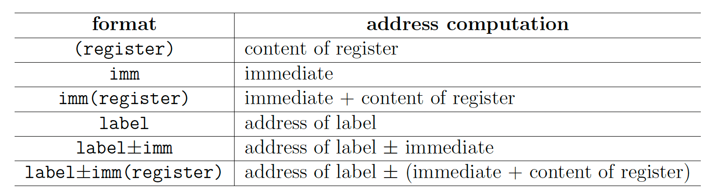
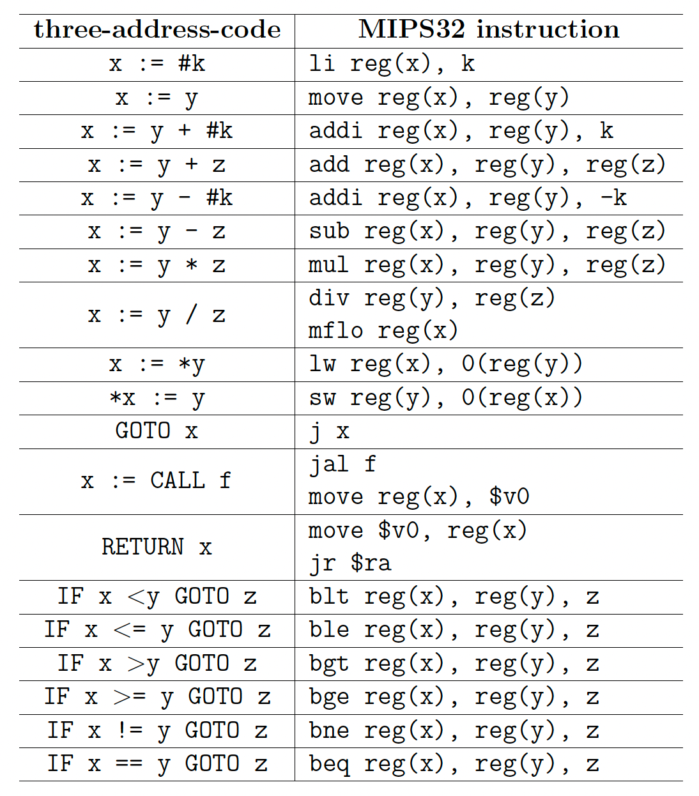
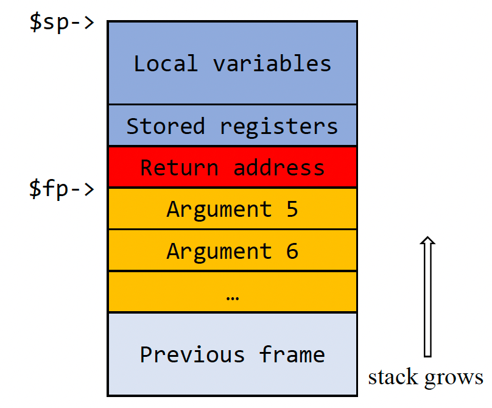
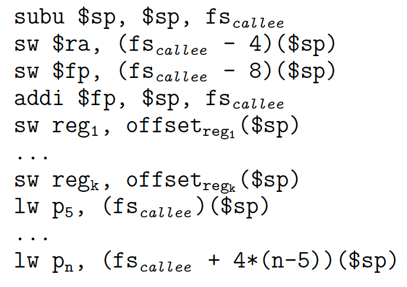
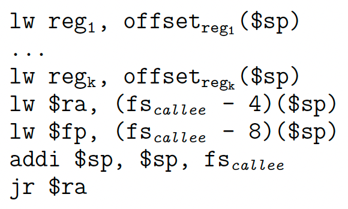

# 阶段 4：目标代码生成

## 1. 概述

我们终于到达了工作编译器的最后一步：目标代码生成。 实际上，我们已经在第三阶段完成了代码生成，其中我们设计了一个概念性的运行时环境，并将源代码转换为遵循该约定的三地址代码。 BPL 语言的三地址代码是一种中级中间表示 (IR)，但是，更底层的东西仍未处理。 有了三地址代码，编译器将处理这些低级内容并最终生成可以在 MIPS32 机器上运行的可执行代码。

机器代码的底层细节在于三个方面：

- 三地址码和机器码并不是一一对应的。 单个 TAC 指令可以翻译为多个机器代码指令，反之亦然。 所以我们必须设计我们的指令选择策略；
- 我们假设三地址代码中的局部变量数量不受限制，尽管现实世界中并非如此。 例如，x86上只有8个通用寄存器，而MIPS32上有32个寄存器（程序的运行时内存也有有限的容量）来支持计算。 我们需要仔细设计寄存器分配算法，以便只有活动变量驻留在寄存器中；
- 我们使用 `ARG` 和 `CALL` TAC 指令来调用带有参数的函数。 然而，大多数硬件中没有针对此任务的特殊指令。 我们应该仅使用跳转和数据移动原语来维护调用堆栈。

在这个阶段，我们将解决上述问题。 我们选择 MIPS32 作为我们的目标语言。 MIPS是一种精简指令集计算机（RISC）指令集架构（ISA），其32位版本称为MIPS32。 MIPS32 是我们编译器的理想目标语言，原因有二：

- 它是精简指令集，指令编码紧凑，语义清晰；
- 它提供了32个寄存器，每个寄存器都有明确的使用约定，有利于寄存器分配/赋值的设计。

为了简化您的实施，我们为您提供了入门代码，以便您可以快速开始。 起始代码定义了几个函数存根，以便您可以插入代码并立即检查结果。 提供加载功能，直接读取并翻译文本IR代码文件； 您还可以使编译器前端适应目标代码生成器。 这两种方法在我们的项目中都是可以接受的，但后者更可取，因为它为您提供了一个端到端的编译器，而且更令人兴奋。

## 2. 实验环境

生成的目标机器代码可以直接在模拟器中运行（实际上，甚至是实际的 MIPS32 机器）。 在实验室虚拟机中，我们安装了 SPIM 模拟器。 SPIM 是一个运行 MIPS32 程序的独立模拟器。 它读取并执行为 MIPS32 处理器编写的汇编语言程序，而不是二进制可执行文件。

要运行生成的 MIPS 代码（假设代码文件路径为 `test/test_a.s`），只需在终端中键入以下命令：
```bash
spim -file test/test_a.s
```

建议以 `.s`/`.asm` 扩展名结束生成的代码文件，但 SPIM 不会检查此扩展名。 有关 SPIM 的更多命令行选项和其他功能，您可以参考其官方文档。（略）

## 3. 指令选择

### 3.1. 编写 MIPS32 汇编

#### 3.1.1. 基础

SPIM 接受文本汇编文件并模拟其执行。 通常，汇编程序文件以 `.s`/`.asm` 扩展名结尾。 汇编程序包含多个代码（或文本）段和数据段，它们对应于 `.text` 和 `.data` 伪指令。 SPIM 还支持单行注释，以 `#` 开头并以换行符结尾。 程序员可以在数据段中声明常量或全局变量，格式如下：

```assembly
name: storage_type value(s)
```

这里，`name` 是一个标签，用于定位声明变量的内存地址，`storage_type` 是变量的数据类型，`value` 是变量的初始值。下表列出了几种常用的数据类型及其声明。


#### 3.1.2. 寄存器

MIPS32有32个寄存器，编号为 0∼31。 每个寄存器都有一个缩写，反映了寄存器的预期用途。 下表显示了所有 MIPS32 寄存器及其在 gcc 中的常规用法。 大多数 MIPS32 寄存器在硬件级别都是相同的，除了 `$0` 始终包含硬连线值 0。这种设计意味着使用约定不是由硬件强制执行的，而是应由软件遵循。 您可以生成不遵守这些约定的工作 MIPS 代码。 然而，由于大多数程序员、编译器、汇编器确实遵循这些约定，因此违反约定会限制生成代码的可移植性。 更糟糕的是，模拟器可能无法执行它们。


寄存器 `$0` 始终包含硬连线值 0，该值无法更改。 寄存器`$at`、`$k0` 和 `$k1` 是为汇编器和操作系统保留的，它们不应该被用户程序或编译器使用。 如果您的编译器尝试使用它们，SPIM 将在加载汇编程序时引发语法错误。 寄存器 `$v0` 和 `$v1` 用于从函数返回值。 寄存器 `$a0` - `$a3` 用于将前四个参数传递给例程（其余参数在堆栈上传递）。

寄存器 `$t0` - `$t9` 是调用者保存的寄存器，用于保存不需要在调用之间保留的临时值。 在进行过程调用之前，调用者应将这些寄存器中的值保存到主内存中。 寄存器 `$s0` - `$s7` 是被调用者保存的寄存器，它们保存应在调用之间保留的长期值。 对于被调用者保存的寄存器中的值，被调用者的工作是在真正执行被调用者的代码之前将它们保存到主内存中，并在被调用者返回之前将它们加载回寄存器。 我们将在第 5 节稍后讨论有关此约定的更多信息。

寄存器 `$gp` 是一个全局指针，指向静态数据段中 64K 内存块的中间，通常它存储一个常量地址 0x10008000。 MIPS32 指令全部编码为 32 位长度。 这些加载和存储指令无法直接访问 32 位地址，因为所有立即值最多为 16 位。 换句话说，我们无法在一条指令中访问超出 16 位范围的地址。 然而，通过 `$gp` 寄存器，我们可以使用带符号的 16 位偏移字段来访问静态数据段的前 64 KB。 例如，要将地址 `0x10010020` 处的字加载到 `$v0` 中，我们可以使用：

```assembly
lw $v0, 0x8020($gp)
```

寄存器 `$sp` 是堆栈指针，指向堆栈区域的顶部，而寄存器 `$fp` (30) 是帧指针。` jal` 指令将过程调用的返回地址写入寄存器 `$ra`，在过程完成并返回后 `jr` 可以使用该地址。

简而言之，您可以使用 `$zero` 作为常量零，分配 `$t0` - `$t9`、`$s0` - `$s7` 任意使用。 `$at`、`$k0`、`$k1` 永远不应该被分配，而其他的则应该在过程调用期间小心维护。

#### 3.1.3. 数据移动

MIPS32 将加载和存储原语分开。 在这种架构下，计算指令的操作数必须预先加载到寄存器中。 SPIM 支持多种加载和存储寻址模式，如下表所示。



#### 3.1.4. 程序案例

在起始代码中，BPL 内置读取函数的指令为：

```assembly
read:
    li $v0, 4
    la $a0, _prmpt
    syscall
    li $v0, 5
    syscall
    jr $ra
```

这里的第一行定义了一个标签 `read`，它对应于函数标识符。 请注意，汇编代码不区分标签名称或函数名称，它们都是标签。 然后 `li` 指令将立即数 4 加载到寄存器 `$v0` 中。 `la` 指令将地址加载到 `$a0`。 这里的地址是在数据段中声明的自定义标识符 `_prmpt`，它是一串提示信息。 系统调用指令触发软件中断以调用特定的操作系统服务。 该服务号已加载到 `$v0` 中。 在本例中，系统调用服务为 4（`print_string`）。 接下来的两行执行 `read_int` 服务。 最后，该过程通过无条件跳转jr返回到返回地址寄存器 `$ra` 中存储的位置。

在上面的代码中，我们假设 `read` 函数的返回地址已经存储在 `$ra` 寄存器中，因此生成的代码可以在调用 `read` 后安全地返回到调用站点。 系统调用 `read_int` 会将其返回值存储到 `$v0` 中，因此生成的代码应该从相应的寄存器中获取该值。 这些运行时行为不是 MIPS32 规范的一部分，而是大多数现实世界编译器的约定。 尽管我们不要求您遵循这些约定，但强烈建议您这样做，因为违反它们可能会导致错误。

### 3.2. 翻译三地址码

指令选择实际上是一个模式匹配的问题。 为了将中间表示转换为机器代码，我们需要找到特定的模式，然后将它们转换为相应的指令。 此过程类似于中间代码生成过程，尽管它依赖于机器。

我们在起始代码中提供了线性 IR 定义，因此转换相当简单：您可以通过一对一映射简单地转换 TAC。下表显示了数据操作和跳转指令的映射方案。 函数 `reg(·)` 代表为变量分配的寄存器，我们稍后会详细讨论。 这个方案并不是独一无二的。 您还可以设计自己的方案以更好地优化代码。



值得一提的是，乘法、除法和分支指令不采用非零常量作为操作数，因此这些指令中涉及的立即数应首先加载到寄存器中。

这种转换方案可能会产生低效的代码。 以整数数组访问表达式 `arr[3]` 的翻译为例。 假设基指针 `arr` 已经存储在寄存器 `$t1` 中，并且要将 `arr[3]` 的值保存到 `$t2` 中，进行一对一映射翻译，可以得到以下代码：

```assembly
addi $t3, $t1, 12
lw $t2, 0($t3)
```

然而，通过利用寻址模式，它们可以合并成一条指令：

```assembly
lw $t2, 12($t1)
```

上面的例子展示了我们如何使用滑动窗口进行局部优化。 通常，我们会向前查看多个 TAC 指令，看看它们是否可以合并为单个目标指令。 这种方法也称为窥孔优化。

## 4. 寄存器分配

大多数 MIPS32 指令的操作数都来自寄存器，加载/存储除外。 任何参与计算/比较的变量都应该首先加载到寄存器中。 由于寄存器的数量有限，我们需要寄存器分配算法来决定哪些值保留在寄存器中以及它们将驻留在哪些寄存器中。

最简单也是最昂贵的方法是将所有变量存储在内存中，并且仅加载下一条指令涉及的那些值。 由于所有 MIPS32 指令最多占用三个地址，因此我们可以简单地将它们分配给 `$t0` - `$t2`。 执行该指令后，我们存储回这些值。 显然，它会生成功能正确的代码，尽管它们可能非常慢。 如果您选择实现这个简单的算法，那完全没问题。 如果这样做，您可以跳过其余小节中介绍的高级算法。

下面我们将介绍两种有关寄存器分配的算法。 值得注意的是，在现实情况下，找到最佳分配是 NP 困难的，因此现代编译器只能找到该问题的近似解决方案。

### 4.1. 本地寄存器分配

寄存器分配的主要挑战是寄存器数量有限。 一般来说，变量的数量多于寄存器的数量，因此变量应该在这些寄存器之间进行交换。 频繁加载和存储变量会带来内存访问的开销，因此我们需要一种机制来正确地将寄存器分配给变量。

局部寄存器分配就是这样一种算法，其中通过启发式仅在基本块内部分配寄存器。 当控制流退出基本块时，所有分配的寄存器的值都应存储到内存中。 当程序进入基本块时，所有寄存器都被标记为空闲。 然后我们扫描基本块中的代码。 如果有变量需要加载到寄存器中，请执行以下操作：

- 如果有空闲寄存器，则将变量分配给它；
- 如果没有寄存器空闲，则将寄存器的内容存储（或溢出）到内存。 显然，最好选择近期不会被访问的寄存器或基本块内的寄存器。

上面的算法采用了一种启发式算法，试图最小化溢出变量的成本。 我们尝试通过贪婪地选择最后访问的变量来减少内存访问的开销。 假设 TAC 指令具有通用形式：

```assembly
z := x op y
```

其中 `x` 和 `y` 是操作数，`op` 是运算符，`z` 存储结果。 本地寄存器分配对每条 TAC 指令执行以下例程：

```C
rx = Ensure(x)
ry = Ensure(y)
rz = Allocate(z)
Emit([rz := rx op ry])
if (x is not needed after the current operation)
    Free(rx)
if (y is not needed after the current operation)
    Free(ry)
```

函数 `Free` 将寄存器标记为空闲，`Emit` 输出一条 MIPS32 指令。 另外两个辅助功能是：

```C
Ensure(x):
    if (x is already in register r)
        result = r
    else
        result = Allocate(x)
        Emit([lw result, x])
    return result
```

```C
Allocate(x):
    if (exists idle register r)
        result = r
    else
        result = register whose value’s next-use is the farthest
        spill result
    return result
```

教科书第 8.6.3 节中描述的 `getReg` 与我们的算法类似。 教科书中的 `getReg` 函数引入了寄存器描述符和地址描述符来消除寄存器之间的数据移动，希望最大限度地减少加载/存储指令的数量。 它更有效，但也更复杂。 您可以选择实现 `getReg` 函数而不是此处描述的本地寄存器分配算法，甚至可以设计并实现您自己的策略。

### 4.2. 全局寄存器分配

本地寄存器分配中的术语“本地”代表我们只关注基本块内的变量。 但是，如果我们尝试跨多个基本块分配寄存器，则本地策略不再有效。 这个问题的主要挑战是：我们不知道程序的实际控制流，因此我们不知道寄存器中的值 `x` 是否应该溢出到内存中，因为控制流可能会跳转到一个基本的 涉及 `x` 的块，或另一个不涉及 `x` 的块。

跨基本块分配寄存器的优点是减少加载/存储操作的数量，从而提高代码效率。 一个典型的例子是，由于程序大部分时间都花在循环中，因此将最活跃的值（例如索引 `i`）保留在固定寄存器中将在块边界节省大量加载/存储指令。

在本地寄存器分配中，我们将所有活动变量存储到每个基本块末尾的内存中。 然而，在全局寄存器分配中，我们应该跨基本块确定每个变量的活跃度，这种技术称为活跃度分析。 然后，我们通过将寄存器分配问题减少到变量干扰图上的图形着色来决定哪些变量驻留在寄存器中。

#### 4.2.1. 活性分析

我们首先定义什么是实时变量。 我们说变量 `x` 在特定的程序位置有效，当且仅当：

1. 如果指令 `i` 使用 `x` 的值，则 `x` 在执行 `i` 之前处于活动状态；
2. 如果 `x` 在执行指令 `i` 之后是活动的，其中 `i` 没有定义 `x`，那么 `x` 在执行 `i` 之前也是活动的；
3. 如果 `x` 在执行指令 `i` 之后处于活动状态，并且可以通过从 `i` 跳转到指令 `j`，则 `x` 在执行 `j` 之前处于活动状态；
4. 如果指令 `i` 定义了 `x` 但没有使用它，则 `x` 在执行 `i` 之前不是活动的（或死亡的）。

规则 1 定义活动变量的起源，规则 2 和规则 3 定义活动如何传播，规则 4 定义活动何时结束。

然后我们将指令 `i` 的后继（successor）定义为：

1. 如果 `i` 无条件跳转到指令 `j`，那么 $succ[i]=\{j\}$；
2. 如果 `i` 有条件跳转到指令 `j`，那么 $succ[i]=\{j, i+1\}$；
3. 如果 `i` 是返回语句，那么  $succ[i]=\emptyset$；
4. 其他情况 $succ[i]=\{i+1\}$。

然后我们将集合 $def[i]$ 定义为在指令 `i` 处定义的变量， $use[i]$ 为在 `i` 处使用/读取的变量集， $in[i]$ 为执行 `i` 之前有效的变量， $out [i]$ 作为执行 `i` 后的实时变量。

遵循这些定义，我们可以将活性分析问题形式化为数据流方程：

$$
\begin{cases}
in[i]=use[i]\cup(out[i]-def[i]) \\
out[i]=\bigcup_{j\in succ[i]}in[j]
\end{cases}
$$

方程组可以迭代求解：一开始， $in[i] = \emptyset$ 。 然后，对于每条指令 `i`，我们根据（1）更新 `in[i]` 和 `out[i]`，直到所有集合收敛到固定大小。 实际上，根据格理论，`in[i]` 和 `out[i]` 的求值顺序并不影响收敛性。 然而，以相反的顺序（即从代码末尾到开头）评估它们可能会更快地收敛。

> **实现提示**
>
> 为了有效地执行集合运算，一个好的做法是应用位向量。 假设通用集合中有 9 个元素，那么我们可以用 9 位来表示这样一个集合及其所有子集。 第 i 个位置上的 1 表示第 i 个元素属于该集合，而 0 表示相反。 在这种表示下，两个集合的交可以通过布尔与运算来执行，两个集合的并可以通过布尔或运算来执行，并且集合的补可以通过布尔非运算来执行。

#### 4.2.2. 通过图着色分配

根据活跃度分析的结果，我们能够进行全局寄存器分配。 显然，我们应该将两个实时变量分配给不同的寄存器，否则，将引入大量加载/存储操作来访问这些实时变量。 然而，有两个例外：

- 对于赋值 `x := y`，`x` 和 `y` 可以共享同一个寄存器，即使它们在赋值后都处于活动状态，因为它们是等效的；
- 对于二元运算 `x := y + z`，如果在该指令之后 `x` 不再存在，而 `y` 仍然存在，则它们不应该共享同一个寄存器，否则，为 `x` 的寄存器分配新值也会覆盖 `y` 的值。

根据上面的分析，我们定义变量 `x` 和 `y` 之间的干扰为：

- $\exists i$, s.t. $x\in out[i]$ 且 $y \in out [i]$；
- $\exists i\neq[x:=y]$, s.t. $x\in def[i]$ 且 $y \in out [i]$。

这里，集合 $def[i]$ 和 $out[i]$ 是通过活性分析收集的，如第 4.2.1 节所述。 这个阶段最重要的事情是：如果 `x` 和 `y` 互相干扰，我们将把它们分配到不同的寄存器。

以程序中的一个变量为顶点，两个变量之间的干涉关系为边，就可以画出程序的干涉图。 假设我们将为每个变量分配一个寄存器，而有 k 个寄存器（k 种颜色）可用。 更重要的是，两个相邻的顶点不能共享相同的寄存器，或者说它们不能具有相同的颜色。 然后寄存器分配就简化为众所周知的图形着色问题。

对于固定的 k，决定图是否可以 k 着色是 NP 完全的。 为了在多项式时间内解决这个问题，我们通常采用启发式方法。 k 着色的一个简单启发式称为 Kempe 算法，它执行以下操作：

1. 如果干扰图中存在度数小于k的顶点，则将其从图中移除，然后将其压入堆栈；
2. 重复步骤1，直到没有顶点可以被删除。 如果剩下的顶点少于 k 个，则为它们分配不同的颜色，然后从堆栈中弹出这些顶点，并为每个顶点分配与其邻居不同的颜色。 否则，转至步骤 3；
3. 移除并推动一个顶点，并将其标记为“溢出”，转至步骤 1；
4. 如果弹出的顶点被标记为“溢出”，请检查其邻居的颜色。 如果它的邻居的颜色少于 k 个颜色，则只需按最后一个颜色分配它，否则，使该节点保持不着色，这意味着它应该被溢出到内存中。

步骤 1 的基本原理是，当删除这样的顶点时，如果生成的图是 k-可着色的，则原始图也必须是 k-可着色的。 对于每个顶点至少有 k 个邻居的图，仍然可以对其进行 k 着色。 但我们无法有效地计算答案，因为它是 NP 完全的。 尽管如此，Kempe 算法为我们提供了一个很好的启发式解决方案来解决图形着色问题，特别是在寄存器分配的情况下。

运行图形着色算法后，中间代码中的所有变量要么被分配寄存器，要么被标记为“溢出”。 对于溢出变量，如果通过某些计算访问它，则应将其加载到特定寄存器中； 计算完成后，将从寄存器存回内存。 要为其分配寄存器，最简单的方法是为溢出变量预先定义一些寄存器。 还有更多获得更好运行时性能的策略，可以在教科书中找到。

## 5. 过程调用约定

### 5.1. 堆栈布局

当调用函数或过程时，编译器应该考虑两个流，即控制流和数据流。 基本上，控制流转换意味着在调用过程之前将程序计数器存储在寄存器 `$ra` 中，并在过程返回之前从该寄存器恢复 PC。 这种机制可以通过 MIPS32 中的 `jal` 和 `jr` 指令轻松维护。 所以你的编译器应该关注数据流转换。 在这里，我们感兴趣的是传递参数和返回值。

从技术上讲，您可以将值存储在任何地方，除了一些不可变寄存器（即 `$zero`、`$at`），但建议您遵循使用约定（第 3.1.2 节）。 要传递参数，您应该同时使用寄存器和堆栈。 对于最多有四个参数的函数，参数的值应分别加载到 `$a0`、`$a1`、`$a2`、`$a3` 中。 第五个及以下参数将存储在堆栈中。 函数的返回值存储在 `$v0` 中。

实现过程调用最重要的内存段是栈。 在运行时，每个函数都会将其激活记录存储在堆栈中，堆栈也称为堆栈帧。 堆栈帧的布局可能因体系结构甚至编译器实现而异。下图显示了典型的堆栈框架布局。 在此布局中，`$sp` 指向堆栈的顶部，而 `$fp` 则指向被调用过程的激活记录的底部。 如果该过程需要四个以上的参数，则以下参数将存储在 `$fp` 之后。 `$fp` 和 `$sp` 之间的内存空间可以存储任何需要的信息。



图中的 Return address 是调用者函数的返回地址，而被调用者函数的返回地址则保存在 `$ra` 中。 当被调用者退出时，应该恢复调用者的返回地址。 这是因为当我们使用指令 `jal` 调用一个过程时，它会覆盖寄存器 `$ra` 的内容，因此我们需要将 `$ra` 的旧值存储到被调用过程的堆栈中，以便以后可以恢复它 。

在寄存器分配中，一些变量会从寄存器溢出到内存中。 与 `$ra` 寄存器一样，如果采用帧指针实现（即教科书中讨论的堆栈分配方法），也应该保存 `$fp` 寄存器，尽管这不是必需的。 对于局部变量，我们将它们存储在堆栈中。 对于全局变量，应该将它们溢出到可写数据段。 由于我们在项目第 4 阶段没有引入全局变量，因此您可以忽略后一种情况。

局部变量通常按照其声明顺序存储在堆栈中。 此外，数组和结构变量应该存储在堆栈中，即使它们只包含适合寄存器大小的单个字段。

### 5.2. 调用和返回序列

如果一个过程/函数 f 调用另一个过程/函数 g，那么我们称 f 为调用者，g 为被调用者。 在被调用者的过程中，一些寄存器将被覆盖。 由于它们的值可能在执行被调用者之后被调用者使用，因此它们应该在执行被调用者的代码之前溢出到内存并在执行后恢复。 那么问题来了：这些寄存器保存操作应该在哪里进行呢？ 在调用者或被调用者中？ 在调用者看来，它不知道被调用者将使用哪些值； 对于被调用者来说，它不知道调用后哪些值对调用者仍然有用。 因此他们只能将所有寄存器存储在他们的程序中，这导致效率低下。

解决这个问题的一般方法是将寄存器存储在调用者和被调用者中。 MIPS32 提供调用者保存的寄存器（`$t0` - `$t9`）和被调用者保存的寄存器（`$s0` - `$s8`）。 建议调用者保存在过程调用期间将写入的那些寄存器（`$t0` - `$t9` 中的部分）的内容。 另一方面，被调用者应该保存这些寄存器的内容（`$s0` - `$s8`中的部分），这在调用后仍然有用。

#### 5.2.1. 调用者序列

当调用者调用另一个函数时，它应该将所有调用者保存的寄存器的值存储到堆栈中，然后将参数加载到寄存器中（或压入堆栈）。 当被调用者返回时，调用者应该恢复那些保存的寄存器值。 该例程的指令序列如下：

```assembly
sw live1, offset[live1]($sp)
...
sw livek, offset[livek]($sp)
subu $sp, $sp, max{0, 4*(n-5)}
move $a0, arg1
...
move $a3, arg4
sw arg5, 0($sp)
...
sw argn, (4*(n-5))($sp)
jal callee
addi $sp, $sp, max{0, 4*(n-5)}
lw live1, offset[live1]($sp)
...
lw livek, offset[livek]($sp)
```

上面的代码假设所有参数在函数调用之前都已加载到寄存器中。 在实践中，您还可以计算并传递参数。 但是，如果选择后一种策略，则应仔细维护每个变量的偏移量，因为堆栈指针 `$sp` 的值可能会在此过程中发生变化。 为了解决这个问题，你也可以选择帧指针 `$fp` 作为基地址，而不是使用 `$sp`。

#### 5.2.2. 被调用者序列

调用序列位于被调用者主体的顶部，也称为序言； 另一方面，返回序列位于底部，我们称之为尾声。

序言负责设置激活记录，存储返回地址和帧指针。 然后，存储被调用者保存的寄存器，并获取参数：



在尾声中，被调用者保存的寄存器以及堆栈都被恢复：



其中 $fs_g$ 表示函数 g 的栈帧大小。

正如我们在调用者序列中建议的那样，您还可以通过帧指针而不是堆栈指针来引用堆栈。

最后我们讨论过程调用如何影响寄存器分配。 被调用者保存的寄存器 `$s0` - `$s8` 在过程调用中保留它们的值，因此调用者不需要考虑它们的分配。 重要的是调用者保存的寄存器 `$t0` - `$t9`，因为它们的值在过程调用后会丢失。

如果采用本地寄存器分配，则 `$t0` - `$t9` 中的所有值应在 `CALL` 指令之前溢出，并在过程调用后恢复。 至于全局寄存器分配，您应该避免将 `$t0` - `$t9` 分配给 `CALL` 指令中的那些变量。 如果您采用简单的寄存器分配，则可以忽略这些建议。

## 6. 项目要求

### 6.1. 基础要求

（略）

### 6.2. 假设

- 假设 1：中间代码在逻辑上是正确的，这意味着您可以在IR模拟器上运行它们并获得正确的输出；
- 假设 2：没有结构体或数组变量，因此不需要翻译 DEC 指令；
- 假设 3：所有整数常量都在 $[−2^{16}, 2^{16})$ 范围内，以便它们可以安全地由 MIPS32 立即数表示。

### 6.3. 所需任务

#### 6.3.1. 寄存器分配

您的第一个任务是设计并实现寄存器分配算法。 除了一种非常简单的算法之外，我们在第 4 节中讨论了两种寄存器分配算法。 这两种算法在代码效率和实现复杂性方面有所不同。 您还可以实施自己的策略以获得更好的性能。

我们在提供的文件 `mips32.h` 中定义了寄存器描述符 (`struct RegDesc`) 和地址描述符 (`struct VarDesc`)。 您可以根据需要添加（或删除）字段。 您应该实现两个函数 `get_register` 和 `get_register_w`。 `w` 后缀表示获得的寄存器将用于加载值。 分离寄存器使用的主要原因是，覆盖寄存器会使相应的变量不再存在于该位置，因此应该将寄存器的旧值溢出到内存以保证数据一致性（如果需要）。 此外，您还应该实现溢出寄存器函数，当没有可用的寄存器用于新值时将调用该函数。

#### 6.3.2. TAC 翻译

您需要完成的另一项任务是翻译一些 TAC 指令。 起始代码已经提供了一些示例。 下面的代码显示了 `LABEL` TAC 语句的翻译功能。 每个发射器函数接受 TAC 实例的结构，并返回下一个要翻译的 TAC 指令。 此模式可以在目标代码生成期间实现本地优化。

```c
tac *emit_label(tac *label) {
    assert(_tac_kind(label) == LABEL);
    _mips_printf("label%d:", _tac_quadruple(label).labelno->int_val);
    return label->next;
}
```

这里的主要任务是翻译过程调用序列，它对应于四个 TAC 指令：`ARG`、`CALL`、`PARAM` 和 `RETURN`。 您还可以修改已实现的函数以获得更优化的代码。